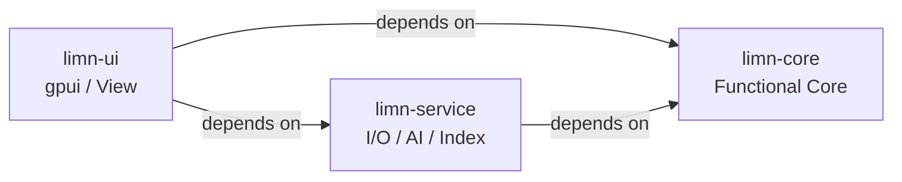
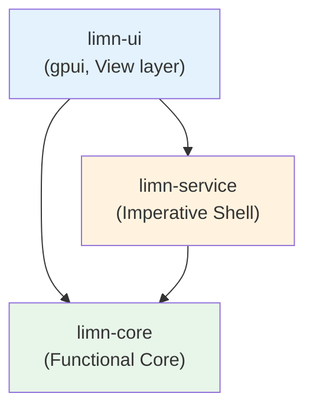
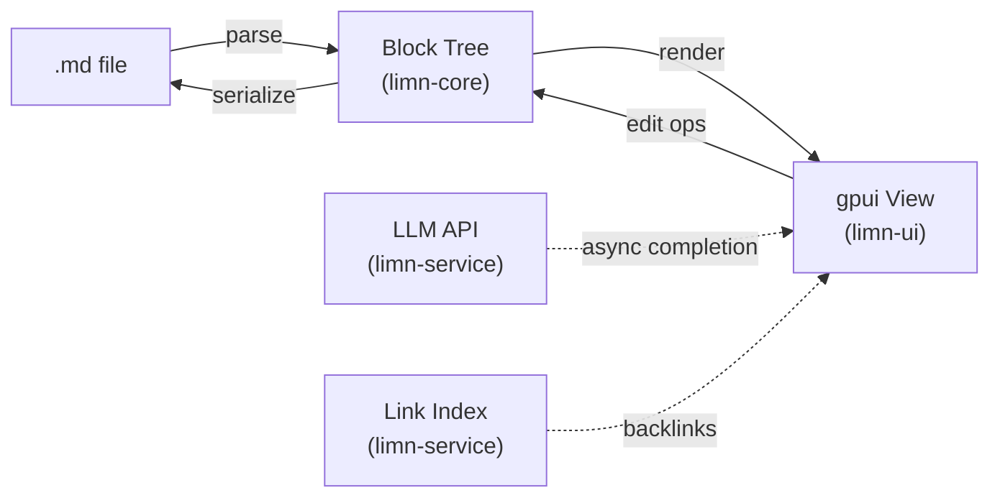

# ARCHITECTURE.md

Limn is a simple, AI-integrated native editor for keyboard-first editing of `.md` files
within a folder. Built in Rust on the gpui UI framework, it uses Markdown as the
sole storage format.

Design decision rationale is recorded as ADRs under `docs/adr/`.
For the feature inventory see `docs/design/basic-features.md`;
for the testing approach see `docs/design/testing-strategy.md`.

---

## Overview

### Core Requirements

| # | Requirement | Meaning |
|---|-------------|---------|
| 1 | **Store as Markdown** | Saves as `.md`. No proprietary binary format. Git diffs are readable; no lock-in. |
| 2 | **Operate via `/` commands** | Block insertion, transformation, and movement are invoked via `/`. No mouse required. |
| 3 | **Keyboard-first editing** | Editing, moving, and transforming existing blocks follow the same philosophy. Consistent UI. |
| 4 | **Knowledge management (A/B/C)** | A: links / B: hierarchy (folder) / C: date stream (daily notes). The foundation — a set of `.md` files in a folder — is enough on its own. |

### Design Axes

- **Quiet UI** — Nothing extra on screen. No handles, hover menus, or toolbars.
- **Keyboard-first** — Modal editing is not adopted. Modeless and fast.
- **AI blends in** — AI is not a bolted-on feature; it integrates naturally into the writing experience. But not overdone.

### Crate Structure



Dependencies are one-way only. Reverse direction (e.g. `limn-core` → `limn-service`) is forbidden.

### Dependency Direction Constraints



`limn-core` uses `std` only. Do not add `tokio` / `gpui` / I/O crates.
`limn-service` uses `limn-core` plus async / I/O crates only. Do not add `gpui`.

### Data Flow



The main thread never blocks. AI calls, saves, and index builds are offloaded to
background threads in `limn-service`; results are returned to the View asynchronously.

---

## Code Map

### `crates/limn-core` — Functional Core

**Responsibility**: All business logic of Limn. Composed of pure functions.

- **`block/`** — Block tree (linear blocks and folding). Insert, move, and transform operations.
- **`markdown/`** — Round-trip conversion between `.md` and Block Tree (`md → tree → md` with no information loss — this is the lifeline of the editor).
- **`completion/`** — Rule-based completion engine. Separated into candidate providers, gates, and policy.
- **`link/`** — Parsing and analysis of `[[file]]` links.

**Constraint**: `std` only. No `tokio` / `gpui` / `reqwest` or similar.
All modules are side-effect-free → unit tests run extremely fast.

```
limn-core/
  src/
    block.rs        # block tree definition and operations
    markdown.rs     # md <-> BlockTree conversion
    completion.rs   # completion engine (providers / gates / policy)
    link.rs         # [[wikilink]] parser
    lib.rs
```

### `crates/limn-service` — Imperative Shell

**Responsibility**: The boundary with the outside world. All I/O, AI calls, and index building are confined here.

- **File I/O** — Reading and writing `.md` files, watching for external changes, autosave.
- **AI calls** — Calls LLM APIs asynchronously on background threads. Returns results as `core` blocks.
- **Link index / backlinks** — Parses `[[file]]` links across all `.md` files and builds a reverse index on a background thread.
- **Graph data** — Graph structure of link relationships (data for automatic layout).

**Constraint**: `limn-core` plus async / I/O crates only. Do not import `gpui`.

```
limn-service/
  src/
    file.rs         # .md read/write / watcher / autosave
    ai.rs           # LLM API client (async)
    link_index.rs   # backlink index and graph data
    lib.rs
```

### `crates/limn-ui` — View Layer

**Responsibility**: gpui bindings and UI logic. Translates user input into `core` operations and executes I/O via `service`.

- **Editor view** — Renders the block tree via gpui. Handles cursor, selection, and scrolling.
- **`/` command palette** — Block insertion and transformation commands opened with a slash.
- **AI UI** — Text selection → shortcut → AI call → diff insertion.
- **Graph view** — Visualization of link relationships (automatic layout).
- **Focus mode** — Highlights the current point; dims everything else.

**Important implementation notes**:
- Use the git main version of `gpui` / `gpui-component` (it has newer features than the crates.io release).
- gpui is pre-1.0 with frequent breaking changes → keep the UI layer thin and localize gpui dependencies.
- Starting point: understand the structure by running `cargo run --example editor` and `cargo run --example markdown`.

```
limn-ui/
  src/
    main.rs         # entry point / gpui app initialization
    editor/         # editor view
    palette/        # / command palette
    graph/          # graph view
    lib.rs
```

---

## Cross-cutting Concerns

### Thread Model

The main thread (gpui) handles UI rendering only. It must never block.

| Operation | Thread | Approach |
|-----------|--------|----------|
| UI rendering / cursor / key input | Main thread | Synchronous, immediate |
| Rule-based completion | Main thread | Synchronous; lightweight enough to allow |
| `.md` autosave | Background thread | Async |
| AI completion | Background thread | Async; result is inserted when ready |
| Backlink index build | Background thread | Async; incremental updates |

### Completion Engine Structure

Separate "who produces candidates" from "who decides when to show them." Adjust timing by swapping only the latter.

```
Input event
  → Context extraction
  → Candidate providers (multiple specialists: heading / list / URL / AI …)
  → Gate (aggregation, ranking, "stay silent now" decision)
  → Policy (breathing: when / how many / how long to wait ← only this part is swapped to tune)
  → Display (candidates below the cursor)
  → Accept (Tab) / Reject (Esc)
  → Learning log (records accept/reject and feeds back into policy; initially just a placeholder)
```

Default policy: **silent by default. Show only when triggered by `/` or `#`.**

### Markdown Round-trip

`md → Block Tree → md` with no information loss is the lifeline of this editor.
The testing strategy treats this as the top priority as well (→ `docs/design/testing-strategy.md`).

Format invariance tests live in limn-core in large numbers and must pass in CI.

### Feature Flag

Incomplete features are not held in long-lived branches; they are hidden behind feature flags and merged into main (trunk-based). Three-stage model:

| Stage | Toggle | User-visible |
|-------|--------|--------------|
| 1: hidden | Env var only (`LIMN_FEAT_<NAME>=1`) | Not accessible |
| 2: experimental | Env var + settings UI | User-enabled at own risk |
| 3: stable | Flag removed | Available normally |

Details: `docs/development/feature-flags.md`, inventory: `docs/development/flag-inventory.md`

### Known Limitations — GPL Contamination

A transitive dependency of `gpui` (`sum_tree` → `ztracing` → `zlog`) is
`GPL-3.0-or-later`. Limn is `Apache-2.0`, so copyleft consistency breaks at
binary distribution time.

Current decision: wait for the upstream issue ([zed-industries/zed#55470](https://github.com/zed-industries/zed/issues/55470))
to be resolved. No re-evaluation until M5.

→ Details recorded in ADR-0003.

---

## Milestone Overview

| M | Goal | Status |
|---|------|--------|
| M1 | Read-only `.md` display (render one file in gpui) | In progress |
| M2 | Keyboard editing + autosave | Not started |
| M3 | `/` command palette (block insertion) | Not started |
| M4 | `[[link]]` backlinks + graph view | Not started |
| M5 | AI integration (selection → summarize / continue) | Not started |

---

## Open Questions

The following design decisions are not yet finalized. They will be resolved during implementation.

### AI Integration Approach

- **Primary candidate**: "Select and ask" — text selection → shortcut or `/` to invoke AI. User stays in control; AI does not appear uninvited. Simplest approach.
- **Alternative 1**: AI instruction area directly below the cursor.
- **Alternative 2**: Proactive background suggestions (AI offers completions without explicit invocation; tension with simplicity).

### Scope of `/`

Insertion only, or an all-purpose entry point covering move, transform, and delete as well.

### Completion "Breathing"

When to surface candidates. If simplicity is the priority, lean toward "silent by default, show when asked."
Requires tuning against real usage.

### AI Model Selection and Switching

Which LLM API to call. Whether to confine provider swapping inside `limn-service` or expose it as a user-configurable setting.

### Graph View Layout Algorithm

Which algorithm to use for automatic layout (force-directed / hierarchical / etc.).
Performance characteristics as node count grows.

### IME Quality

The quality of gpui's Japanese IME support is not yet established. Real-device verification is needed early in M2.
